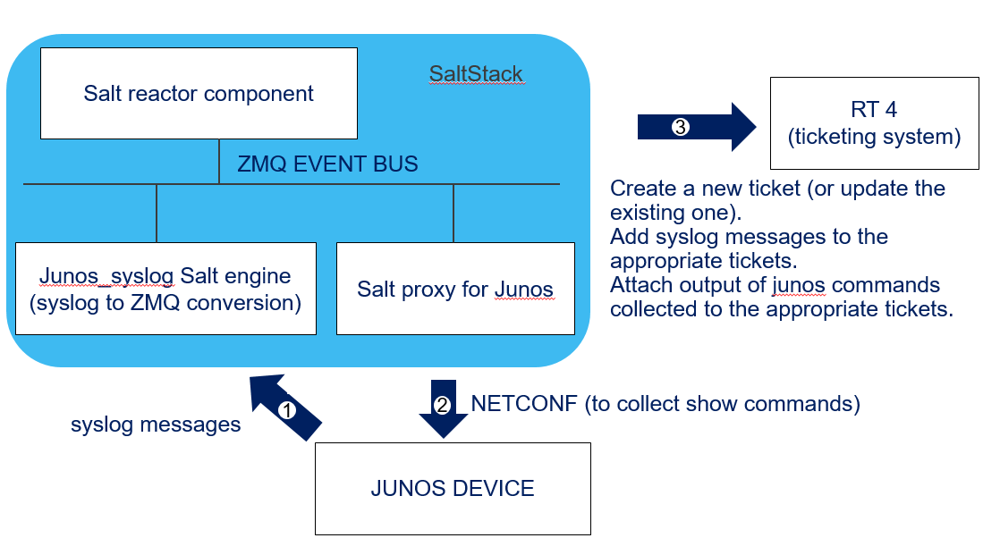

# Documentation structure

[About this project](#about-this-project)  
[Lab description](#lab-description)  
[About the demo](#about-the-demo)    
&nbsp;&nbsp;&nbsp;&nbsp;[Overview](#overview)  
&nbsp;&nbsp;&nbsp;&nbsp;[Details](#details)  
&nbsp;&nbsp;&nbsp;&nbsp;[Building blocks description](#building-blocks-description)    
[Instructions to prepare the setup](#instructions-to-prepare-the-setup)  
&nbsp;&nbsp;&nbsp;&nbsp;[Overview](##overview-1)  
&nbsp;&nbsp;&nbsp;&nbsp;[Clone this repository](#clone-this-repository)  
&nbsp;&nbsp;&nbsp;&nbsp;[Install Docker](#install-docker)  
&nbsp;&nbsp;&nbsp;&nbsp;[Instanciate a Request Tracker container](#instanciate-a-request-tracker-container)  
&nbsp;&nbsp;&nbsp;&nbsp;[Install a python library to consume RT REST API](#install-a-python-library-to-consume-rt-rest-api)  
&nbsp;&nbsp;&nbsp;&nbsp;[Install SaltStack](#install-saltstack)  
&nbsp;&nbsp;&nbsp;&nbsp;&nbsp;&nbsp;&nbsp;&nbsp;[Overview](#overview-2)  
&nbsp;&nbsp;&nbsp;&nbsp;&nbsp;&nbsp;&nbsp;&nbsp;[Install master](#install-master)   
&nbsp;&nbsp;&nbsp;&nbsp;&nbsp;&nbsp;&nbsp;&nbsp;[Install Minion](#install-minion)   
&nbsp;&nbsp;&nbsp;&nbsp;&nbsp;&nbsp;&nbsp;&nbsp;[Install requirements for SaltStack Junos proxy](#install-requirements-for-saltstack-junos-proxy)  
&nbsp;&nbsp;&nbsp;&nbsp;&nbsp;&nbsp;&nbsp;&nbsp;[Install the junos syslog engine dependencies](#install-the-junos-syslog-engine-dependencies)  
&nbsp;&nbsp;&nbsp;&nbsp;[Configure SaltStack](#configure-your-setup)  
&nbsp;&nbsp;&nbsp;&nbsp;&nbsp;&nbsp;&nbsp;&nbsp;[Overview](#overview-3)  
&nbsp;&nbsp;&nbsp;&nbsp;&nbsp;&nbsp;&nbsp;&nbsp;[Configure SaltStack master](#configure-saltstack-master)  
&nbsp;&nbsp;&nbsp;&nbsp;&nbsp;&nbsp;&nbsp;&nbsp;[Configure SaltStack minion](#configure-saltstack-minion)  
&nbsp;&nbsp;&nbsp;&nbsp;&nbsp;&nbsp;&nbsp;&nbsp;[Configure SaltStack pillars](#configure-saltstack-pillars)  
&nbsp;&nbsp;&nbsp;&nbsp;&nbsp;&nbsp;&nbsp;&nbsp;[Configure SaltStack proxy](#configure-saltstack-proxy)  
&nbsp;&nbsp;&nbsp;&nbsp;&nbsp;&nbsp;&nbsp;&nbsp;[Configure SaltStack files server](#configure-saltstack-files-server)  
&nbsp;&nbsp;&nbsp;&nbsp;&nbsp;&nbsp;&nbsp;&nbsp;[Configure SaltStack junos syslog engine](#configure-saltstack-junos-syslog-engine)  
&nbsp;&nbsp;&nbsp;&nbsp;&nbsp;&nbsp;&nbsp;&nbsp;[Configure SaltStack reactor](#configure-saltstack-reactor)  
&nbsp;&nbsp;&nbsp;&nbsp;&nbsp;&nbsp;&nbsp;&nbsp;[Configure SaltStack runners](#configure-saltstack-runners)  
&nbsp;&nbsp;&nbsp;&nbsp;[Configure Junos devices to send syslog messages to salt master](#configure-junos-devices-to-send-syslog-messages-to-salt-master)  
[Run the demo](#run-the-demo)  


# About this project 

Junos automation demo using SaltStack and a ticketing system (Request Tracker).  
Based on syslog from junos, SaltStack automatically creates a new ticket or update the existing one. It also automatically collects "show commands" from junos devices and attach the devices output to the appropriate tickets.  

For a more advanced equivalent demo, please visit the repository https://github.com/ksator/automation_summit_Q3_2018  

# Lab description

Building blocks:  
- Junos (one vMX)
- Ubuntu (one host) with Docker, RT (Request Tracker), SaltStack.  
 
| hostname  | Management IP address  | Management interface  | Operating system | Version  | 
| ------------- | ------------- | ------------- | ------------- | ------------- |
| ubuntu | 100.123.35.1  | eth0  | ubuntu  | 16.04  |
| vMX-1 | 100.123.1.1 | me0  | Junos  | 17.4R1-S2.2  | 


# About the demo 

## Overview  
- Junos devices send syslog messages to SaltStack.  
- Based on syslog messages received from junos devices: 
  - SaltStack automatically manages RT (Request Tracker) tickets to track this issue. 
      - If there is already an existing ticket to track this issue, SaltStack updates the existing ticket with the new syslog message. 
      - If there is no existing ticket to track this issue, SaltStack creates a new ticket and add the new syslog message to the new ticket.  
  - SaltStack automatically collects "show commands" output from junos devices and attach the devices output to the appropriate tickets. 

  


## Details 

- Here's more detailled presentations of this demo: [automated tickets management based on syslog messages](automated_tickets_management.pdf)  
- Here's a presentation of another automated ticket management demo: [automated tickets management based on webhook notifications](OpenConfig_telemetry_demo.pdf)


## Building blocks description

### Junos
- There is one single Junos device
- The hostname is ```vMX-1```
- It is configured to send ```SNMP_TRAP_LINK_UP``` and ```SNMP_TRAP_LINK_DOWN``` syslog messages to SaltStack 

### Request Tracker 
- This is the ticketing system.  
- The tickets are automatically created and updated by SaltStack based on Junos syslog messages. 
- Junos "show commands" output are automatically collected by SaltStack and attached to the appropriate tickets.  

### SaltStack
- This demo uses these SaltStack components: A master, a minion, a proxy, the junos_syslog engine.  
- All in one SaltStack setup: all the above components runs on the same Ubuntu host.  
- The Salt master listens to syslog messages sent by junos devices
- The Salt master generates a ZMQ messages to the event bus when a junos syslog message is received. The ZMQ message has a tag and data. The data structure is a dictionary, which contains information about the event.
- The Salt reactor binds sls files to event tags. The reactor has a list of event tags to be matched, and each event tag has a list of reactor SLS files to be run. So these sls files define the SaltStack reactions.
- The reactor sls file does the following: 
    - parses the data from the ZMQ messages to extracts the network device name
    - searches for an existing ticket for this syslog message and device. If there is no existing ticket for this syslog message and device it will create a new one. If there is an existing ticket for this syslog message and device it will update it
    - asks to the proxy that manages the device that sent this syslog message to collect junos show commands output 
    - attaches to the ticket the output of the junos commands


### Ubuntu
- There is one single Ubuntu host 
- It has SaltStack installed: all the SaltStack components described above are installed on the same Ubuntu host.   
- It has Docker installed. It has RT (docker container)   

# Instructions to prepare the setup

## Overview

- Clone this repository
- Install Docker
- Instanciate a Request Tracker container
- Install a python library to consume RT REST API
- Install SaltStack
- Configure SaltStack
- Configure Junos 

 
## Clone this repository 
```
$ sudo -s
# cd
# git clone https://github.com/JNPRAutomate/automated_tickets_management_with_syslog_saltstack_RT.git
# ls automated_tickets_management_with_syslog_saltstack_RT
```

## Install Docker

Check if Docker is already installed
```
$ docker --version
```

If it was not already installed, install it:
```
$ sudo apt-get update
```
```
$ sudo apt-get install \
    apt-transport-https \
    ca-certificates \
    curl \
    software-properties-common
```
```
$ curl -fsSL https://download.docker.com/linux/ubuntu/gpg | sudo apt-key add -
```
```
$ sudo add-apt-repository \
   "deb [arch=amd64] https://download.docker.com/linux/ubuntu \
   $(lsb_release -cs) \
   stable"
```
```
$ sudo apt-get update
```
```
$ sudo apt-get install docker-ce
```
```
$ sudo docker run hello-world
```
```
$ sudo groupadd docker
```
```
$ sudo usermod -aG docker $USER
```

Exit the ssh session and open an new ssh session and run these commands to verify you installed Docker properly:  
```
$ docker run hello-world

Hello from Docker!
This message shows that your installation appears to be working correctly.

To generate this message, Docker took the following steps:
 1. The Docker client contacted the Docker daemon.
 2. The Docker daemon pulled the "hello-world" image from the Docker Hub.
    (amd64)
 3. The Docker daemon created a new container from that image which runs the
    executable that produces the output you are currently reading.
 4. The Docker daemon streamed that output to the Docker client, which sent it
    to your terminal.

To try something more ambitious, you can run an Ubuntu container with:
 $ docker run -it ubuntu bash

Share images, automate workflows, and more with a free Docker ID:
 https://hub.docker.com/

For more examples and ideas, visit:
 https://docs.docker.com/engine/userguide/
```
```
$ docker --version
Docker version 18.03.1-ce, build 9ee9f40
```

## Instanciate a Request Tracker container

Request Tracker (RT) is an open source issue tracking system.  
There is a Request Tracker Docker image available https://hub.docker.com/r/netsandbox/request-tracker/  

### Pull a Request Tracker Docker image

Check if you already have it locally:   
```
$ docker images
```

if not, pull the image:
```
$ docker pull netsandbox/request-tracker
```
Verify: 
```
$ docker images
REPOSITORY                   TAG                 IMAGE ID            CREATED             SIZE
netsandbox/request-tracker   latest              b3843a7d4744        4 months ago        423MB
```

### Instanciate a Request Tracker container
```
$ docker run -d --rm --name rt -p 9081:80 netsandbox/request-tracker
```
Verify: 
```
$ docker ps
CONTAINER ID        IMAGE                        COMMAND                  CREATED             STATUS                  PORTS                                                 NAMES
0945209bfe14        netsandbox/request-tracker   "/usr/sbin/apache2 -…"   26 hours ago        Up 26 hours             0.0.0.0:9081->80/tcp                                  rt
```

### Verify you can access to RT GUI

Access RT GUI with ```http://100.123.35.1:9081``` in a browser.  
The default ```root``` user password is ```password```

## Install a python library to consume RT REST API 

There are python libraries that provide an easy programming interface for dealing with RT:  
- [rtapi](https://github.com/Rickerd0613/rtapi) 
- [python-rtkit](https://github.com/z4r/python-rtkit)
- [rt](https://github.com/CZ-NIC/python-rt) 

### Install the ```rt``` library

```
$ sudo -s
```
```
# apt-get install python-pip
```
```
# pip install requests nose six rt
```
Verify
```
# pip list
```

### Verify you can use ```rt``` Python library
Python interactive session
```
# python
Python 2.7.12 (default, Dec  4 2017, 14:50:18)
[GCC 5.4.0 20160609] on linux2
Type "help", "copyright", "credits" or "license" for more information.
>>> import rt
>>> tracker = rt.Rt('http://100.123.35.1:9081/REST/1.0/', 'root', 'password')
>>> tracker.url
'http://100.123.35.1:9081/REST/1.0/'
>>> tracker.login()
True
>>> tracker.search(Queue='General', Status='new')
[]
>>> tracker.create_ticket(Queue='General', Subject='abc', Text='bla bla bla')
1
>>> tracker.reply(1, text='notes you want to add to the ticket 1')
True
>>> tracker.search(Queue='General')
[{u'Status': u'open', u'Priority': u'3', u'Resolved': u'Not set', u'TimeLeft': u'0', u'Creator': u'root', u'Started': u'Wed Jul 11 09:30:57 2018', u'Starts': u'Not set', u'Created': u'Wed Jul 11 09:30:10 2018', u'Due': u'Not set', u'LastUpdated': u'Wed Jul 11 09:30:57 2018', u'FinalPriority': u'0', u'Queue': u'General', 'Requestors': [u''], u'Owner': u'Nobody', u'Told': u'Not set', u'TimeEstimated': u'0', u'InitialPriority': u'0', u'id': u'ticket/1', u'TimeWorked': u'0', u'Subject': u'abc'}]
>>> for item in  tracker.search(Queue='General'):
...    print item['id']
...
ticket/1
>>> tracker.logout()
True
>>> exit()
```

### Using RT GUI, verify the ticket details you created previously with Python interactive session


## Install SaltStack

### Overview 

- Install master
- Install minion 
- Install requirements for SaltStack Junos proxy
- Install requirements for SaltStack Junos_syslog engine

### Install master

Check if SaltStack master is already installed
```
$ sudo -s
```
```
# salt --version
```
```
# salt-master --version
```
if SaltStack master was not already installed, then install it: 
```
$ sudo -s
```
```
# wget -O - https://repo.saltstack.com/apt/ubuntu/16.04/amd64/archive/2018.3.2/SALTSTACK-GPG-KEY.pub | sudo apt-key add -
```
Add ```deb http://repo.saltstack.com/apt/ubuntu/16.04/amd64/archive/2018.3.2 xenial main``` in the file ```/etc/apt/sources.list.d/saltstack.list```
```
# touch /etc/apt/sources.list.d/saltstack.list
```
```
# nano /etc/apt/sources.list.d/saltstack.list
```
```
# more /etc/apt/sources.list.d/saltstack.list
deb http://repo.saltstack.com/apt/ubuntu/16.04/amd64/archive/2018.3.2 xenial main
```
```
# sudo apt-get update
```
```
# sudo apt-get install salt-master
```
Verify you installed properly SaltStack master 
```
# salt --version
salt 2018.3.2 (Oxygen)
```
```
# salt-master --version
salt-master 2018.3.2 (Oxygen)
```

### Install Minion

Check if SaltStack minion is already installed on the ubuntu host ```minion1```  
```
# salt-minion --version
```
if SaltStack minion was not already installed, then install it: 
```
$ sudo -s
```
```
# wget -O - https://repo.saltstack.com/apt/ubuntu/16.04/amd64/archive/2018.3.2/SALTSTACK-GPG-KEY.pub | sudo apt-key add -
```
Add ```deb http://repo.saltstack.com/apt/ubuntu/16.04/amd64/archive/2018.3.2 xenial main``` in the file ```/etc/apt/sources.list.d/saltstack.list```
```
# touch /etc/apt/sources.list.d/saltstack.list
```
```
# nano /etc/apt/sources.list.d/saltstack.list
```
```
# more /etc/apt/sources.list.d/saltstack.list
deb http://repo.saltstack.com/apt/ubuntu/16.04/amd64/archive/2018.3.2 xenial main
```
```
# sudo apt-get update
```
```
$ sudo apt-get install salt-minion
```
And verify if salt-minion was installed properly installation 
```
# salt-minion --version
salt-minion 2018.3.2 (Oxygen)
```

### Install requirements for SaltStack Junos proxy 

The Salt Junos proxy has some requirements (```junos-eznc``` python library and other dependencies). 

```
# apt-get install python-pip
# pip list
# apt-get --auto-remove --yes remove python-openssl
# pip install pyOpenSSL junos-eznc jxmlease jsnapy
# pip list | grep "pyOpenSSL\|junos-eznc\|jxmlease\|jsnapy"
```

Verify you can use junos-eznc
```
# python
Python 2.7.12 (default, Dec  4 2017, 14:50:18)
[GCC 5.4.0 20160609] on linux2
Type "help", "copyright", "credits" or "license" for more information.
>>> from jnpr.junos import Device
>>> dev=Device(host='100.123.1.1', user="jcluser", password="Juniper!1")
>>> dev.open()
Device(100.123.1.1)
>>> dev.facts['version']
'17.4R1-S2.2'
>>> dev.close()
>>> exit()
```

### Install the junos syslog engine dependencies

Engines are executed in a separate process that is monitored by Salt. If a Salt engine stops, it is restarted automatically.  
Engines can run on both master and minion.  To start an engine, you need to specify engine information in master/minion config file depending on where you want to run the engine. Once the engine configuration is added, start the master and minion normally. The engine should start along with the salt master/minion.   
Junos_syslog engine  listens to syslog messages from Junos devices, extracts event information and generates and pusblishes messages on SaltStack 0MQ bus.  

```
# pip install pyparsing twisted
# pip list | grep "pyparsing\|Twisted"
```

## Configure SaltStack

### Overview 
- Configure SaltStack master
- Configure SaltStack minion 
- Configure SaltStack pillar
- Configure SaltStack proxy 
- Configure SaltStack files server
- Configure SaltStack junos syslog engine
- Configure SaltStack reactor
- Configure SaltStack runner


### Configure SaltStack master

#### SaltStack master configuration file

Copy the [SaltStack master configuration file](master) in the file ```/etc/salt/master```

```
# cp automated_tickets_management_with_syslog_saltstack_RT/master /etc/salt/master
```
So: 
- the Salt master is listening junos syslog messages on port 516. For each junos syslog message received, it generates an equivalent ZMQ message and publishes it to the event bus
- The runners are in the directory ```/srv/runners``` 
- The pillars (variables) are in the directory ```/srv/pillar```
- The files server (states files, templates, ...) are in the directory ```/srv/salt``` 


#### Restart the salt-master service


```
# service salt-master restart
```
#### Verify the salt-master status

To see the Salt processes: 
```
# ps -ef | grep salt
```
To check the status, you can run these commands: 
```
# systemctl status salt-master.service
```
```
# service salt-master status
```
#### SaltStack master log

```
# more /var/log/salt/master 
```
```
# tail -f /var/log/salt/master
```

### Configure SaltStack minion 

#### SaltStack minion configuration file

Copy the [minion configuration file](minion) in the file ```/etc/salt/minion```

```
# cp automated_tickets_management_with_syslog_saltstack_RT/minion /etc/salt/minion
```

#### Restart the salt-minion service


```
# service salt-minion restart
```

#### Verify the salt-minion status

To see the Salt processes: 
```
# ps -ef | grep salt
```
To check the status: 
```
# systemctl status salt-minion.service
```
```
# service salt-minion status
```

#### Verify the keys 

You need to accept the minions/proxies public keys on the master.   


To list all public keys:
```
# salt-key -L
```
To accept a specified public key:
```
# salt-key -a minion1 -y
```
Or, to accept all pending keys:
```
# salt-key -A -y
```

#### Verify master <-> minion communication 

Run this command to make sure the minion is up and responding to the master. This is not an ICMP ping. 
```
# salt minion1 test.ping
```
Run this additionnal test  
```
# salt "minion1" cmd.run "pwd"
```

### Configure SaltStack pillars

Pillars are variables (for templates, sls files ...).    
They are defined in sls files, with a yaml data structure.  
There is a ```top``` file.  
The ```top.sls``` file map minions to sls (pillars) files.  

#### Pillars configuration

Refer to the [master configuration file](master) to know the location for pillars.  
Run these commands to copy [pillars files](pillars) from this repository to the directory ```/srv/pillar``` on the master  

```
# mkdir /srv/pillar
# cp automated_tickets_management_with_syslog_saltstack_RT/pillars/* /srv/pillar
```

#### Pillars configuration verification

```
$ sudo -s
```
```
# salt-run pillar.show_pillar
```
```
# salt-run pillar.show_pillar vMX-1
```


### Configure SaltStack proxy 

#### SaltStack proxy configuration file

Copy the [proxy configuration file](proxy) in the file ```/etc/salt/proxy```  
```
# cp automated_tickets_management_with_syslog_saltstack_RT/proxy /etc/salt/proxy
```

#### Start SaltStack proxy 

You need one salt proxy process per Junos device.
to start the proxy as a daemon for the device ```vMX-1```, run this command
```
# sudo salt-proxy -d --proxyid=vMX-1
```
The proxy daemon ```vMX-1``` manages the network device ```vMX-1```.  
you can run this command to start it with a debug log level: 
```
# sudo salt-proxy -l debug --proxyid=vMX-1
```
To see the SaltStack processes, run this command: 
```
# ps -ef | grep salt
```

#### Verify the keys

You need to accept the minions/proxies public keys on the master.   


To list all public keys:
```
# salt-key -L
```
To accept a specified public key:
```
# salt-key -a vMX-1 -y
```
Or, to accept all pending keys:
```
# salt-key -A -y
```
#### Verify master <-> proxy communication

Run this command to make sure the proxy is up and responding to the master. This is not an ICMP ping. 
```
# salt 'vMX*' test.ping
```
Grains are information collected from minions/proxies.  
List the grains: 
```
# salt vMX-1 grains.ls
```
Get the value of the grain ```nodename``` to know where the proxy daemon ```vMX-1```is running: 
```
# salt vMX-1 grains.item nodename
```
Verify if the host that runs the proxy daemon has the dependencies for Junos modules (```junos-eznc``` python library and other dependencies): 
```
# salt minion1 cmd.run "pip list | grep junos"
```
Run this additionnal test. It is an execution module. The master asks to the proxy ```vMX-1``` to use an execution module
```
# salt 'vMX*' junos.cli "show version"
```

### Configure SaltStack files server

Salt runs a files server to deliver files to minions and proxies.  
The [master configuration file](master) indicates the location for the files server: ```/srv/salt```
The files server has Junos configuration templates and SaltStack state files.  

#### templates for Junos 

Run these commands to copy these [Junos templates](templates) to the directory ```/srv/salt```

```
# mkdir /srv/salt
# cp automated_tickets_management_with_syslog_saltstack_RT/templates/* /srv/salt
```

#### SaltStack state files

Salt establishes a client-server model to bring infrastructure components in line with a given policy (salt state modules, in salt state sls files. kind of Ansible playbooks).  

run these commands to copy these [states files](states) to the directory ```/srv/salt``` 


```
# cp automated_tickets_management_with_syslog_saltstack_RT/states/* /srv/salt
```


The state file [collect_data_locally.sls](states/collect_data_locally.sls) collects junos show commands output  
```
# more /srv/salt/collect_data_locally.sls 
```

The list of junos commands to collect is maintained with the variable ```data_collection```  
the variable ```data_collection``` is defined in the pillar [data_collection.sls](pillars/data_collection.sls)  
Pillars are in the directory ```/srv/pillar```  
```
# more /srv/pillar/data_collection.sls
```

Test your automation content:

```
# salt 'vMX*' state.apply collect_data_locally
# ls /tmp/vMX-1/ -l
# more /tmp/vMX-1/show\ version.txt
```


### Configure SaltStack junos syslog engine

Engines are executed in a separate process that is monitored by Salt. If a Salt engine stops, it is restarted automatically.  
Engines can run on both master and minion.  To start an engine, you need to specify engine information in master/minion config file depending on where you want to run the engine. Once the engine configuration is added, start the master and minion normally. The engine should start along with the salt master/minion.   
Junos_syslog engine  listens to syslog messages from Junos devices, extracts event information and generates and pusblishes messages on SaltStack 0MQ bus.  

We already added the junos syslog engine configuration in the [master configuration file](master) so the junos device should send their syslog messages to the master ip address on port 516. 

```
# more /etc/salt/master
```

### Configure SaltStack reactor

#### Configure reactor configuration file
The reactor binds sls files to event tags. The reactor has a list of event tags to be matched, and each event tag has a list of reactor SLS files to be run. So these sls files define the SaltStack reactions.  

To map some events to reactor sls files, copy the [reactor configuration file](reactor.conf) to ```/etc/salt/master.d/reactor.conf```  

```
# cp automated_tickets_management_with_syslog_saltstack_RT/reactor.conf /etc/salt/master.d/
# more /etc/salt/master.d/reactor.conf
```
This reactor binds ```jnpr/syslog/*/SNMP_TRAP_LINK_*``` to ```/srv/reactor/show_commands_collection_and_attachment_to_RT.sls```  

#### Restart the salt master service
```
# service salt-master restart
```
#### Verify the reactor operationnal state: 
```
# salt-run reactor.list
```
#### Add your reactor sls files
create a ```/srv/reactor/``` directory    
```
# mkdir /srv/reactor/
```
and copy [these sls reactor files](reactor) to the directory ```/srv/reactor/```
```
# cp automated_tickets_management_with_syslog_saltstack_RT/reactor/* /srv/reactor/
# ls /srv/reactor/
# more /srv/reactor/show_commands_collection_and_attachment_to_RT.sls
```

The reactor [show_commands_collection_and_attachment_to_RT.sls](reactor/show_commands_collection_and_attachment_to_RT.sls): 
- parses the data from the ZMQ message that has the tags ```jnpr/syslog/*/SNMP_TRAP_LINK_*``` and extracts the network device name
- searches for an existing ticket for this syslog message and device. If there is no existing ticket for this syslog message and device it will create a new one. If there is an existing ticket for this syslog message and device it will update it
- asks to the proxy that manages the device that sent this syslog message to collect junos show commands output 
- attaches to the ticket the output of the junos commands

The state file [collect_data_locally.sls](states/collect_data_locally.sls) executed by the proxy is located in the ```/srv/salt``` directory.  
It collects junos show commands output  
```
# more /srv/salt/collect_data_locally.sls 
```

The list of junos commands to collect is maintained with the variable ```data_collection```  
the variable ```data_collection``` is defined in the pillar [data_collection.sls](pillars/data_collection.sls)  
Pillars are in the directory ```/srv/pillar```  
```
# more /srv/pillar/data_collection.sls
```

### Configure SaltStack runners

The runner directory is indicated in the [master](master) configuration file

create the directory ```/srv/runners/```
```
# mkdir /srv/runners
```
and add the files [runners](runners) to the directory /srv/runners/
```
# cp automated_tickets_management_with_syslog_saltstack_RT/runners/* /srv/runners/
```
Test your runner:

```
# salt-run request_tracker.create_ticket subject='test subject' text='test text'
```
Verify using The RT GUI. Access RT GUI with http://100.123.35.1:9081 in a browser.  
The default ```root``` user password is ```password```
```
# salt-run request_tracker.change_ticket_status_to_resolved ticket_id=2
```

## Configure Junos devices to send syslog messages to salt master

The Salt master is listening junos syslog messages on port 516.  
The pillar [production.sls](pillars/production.sls) defines the variable ```syslog_host```.  
the variable ```syslog_host``` is the ip address of the salt master.  
This variable is used by the state file [syslog.sls](states/syslog.sls) to render the template [syslog.conf](templates/syslog.conf) 
(to generate Junos configuration).  
the state file [syslog.sls](states/syslog.sls) then loads the generated configuration to Junos devices  

```
# more /srv/pillar/production.sls
# more /srv/salt/syslog.conf
# more /srv/salt/syslog.sls
```
To get the value of the variable ```syslog_host```, run this command:  
```
# salt 'vMX-1' pillar.item syslog_host
```
To execute the state file [syslog.sls](states/syslog.sls), run this command:  
```
# salt 'vMX*' state.apply syslog
```
To verify, run these commands: 
```
# salt vMX-1 junos.cli "show system commit"
# salt vMX-1 junos.cli "show configuration | compare rollback 1"
# salt vMX-1 junos.cli "show configuration system syslog host 100.123.35.1"
# salt vMX-1 junos.cli "show configuration system syslog host 100.123.35.1 | display set"

```


# Run the demo

## Verify the salt master receives syslog messages from Junos devices

The Salt master is listening junos syslog messages on port 516.  
Run this command to see the syslog messages sent by junos devices on port 516.  

```
# tcpdump -i eth0 port 516 -vv
```

## Watch the Event bus

Salt provides a runner that displays events in real-time as they are received on the Salt master.  
to watch the 0MQ event bus, run this command  
```
# salt-run state.event pretty=True
```

## Trigger a syslog message from a junos device 

Shutdown an interface of a junos device.  

```
# salt vMX-1 junos.cli 'show interfaces terse ge-0/0/1'
# salt vMX-1 junos.install_config 'salt://disable_interface.set' confirm=1
# salt vMX-1 junos.cli 'show interfaces terse ge-0/0/1'
# salt vMX-1 junos.cli 'show configuration | compare rollback 1'
```

The operationnal state of the interface ```ge-0/0/1``` moved from up to down.  
The junos device sent a syslog message ```SNMP_TRAP_LINK_DOWN``` to SaltStack.  
SaltStack rans show commands on this device and attached the data collected to a ticket.  
Verify the ticket details on the RT GUI


